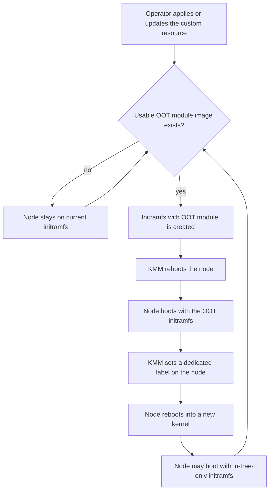
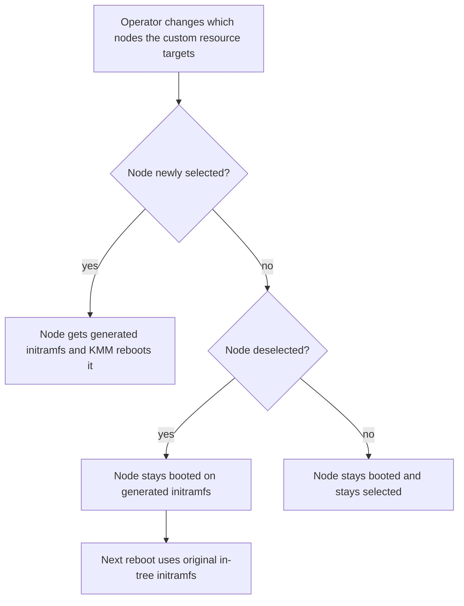

# Allow upgrading and adding kernel modules into initramfs

| Field       | Value   |
|-------------|---------|
| Author(s)   | Yevgeny Shnaidman |
| Jira        | https://issues.redhat.com/browse/MGMT-25378 |
| Date        | 2026-09-08 |

## 1. Problem Statement

OpenShift nodes boot from an initramfs that already contains in-tree kernel modules. When those modules serve the filesystem or the network, a KMM operator cannot replace them later with a more advanced out-of-tree (OOT) module by loading a Module after the node is up. The same gap applies when an OOT module is needed in initramfs but was never in the original image. Without this capability, storage and network OOT drivers cannot take over from in-tree equivalents for early boot, and cluster or kernel upgrades leave nodes on in-tree initramfs modules with no supported way to put the OOT module back into initramfs. [Jira: MGMT-25378]

## 2. Goals and Non-Goals

### 2.1 Goals

- A KMM operator can replace an in-tree initramfs module with a same-name OOT module on selected worker nodes, and those nodes reboot onto an initramfs that contains the OOT module. [Jira: MGMT-25378] [Clarify: R1.Q2]
- A KMM operator can add an OOT module that was not in the original initramfs, and selected worker nodes reboot onto an initramfs that contains it. [Clarify: R2.Q3]
- After a cluster or kernel upgrade, selected nodes that still have this request in place end up on an initramfs that contains the OOT module, including a first reboot that may still use in-tree-only initramfs. [Clarify: R2.Q4]
- A KMM operator can create, update, and delete this request in the OpenShift web console and with `oc`, without applying a Module for these modules. [Clarify: R3.Q1] [Clarify: R4.Q1]
- After a node reboots into the initramfs that contains the OOT modules, KMM labels that node so applications that need the OOT driver can be scheduled onto it. [User]
- After the generated initramfs is applied, that node stays booted. If the operator changes which nodes the custom resource targets, newly selected nodes get the generated initramfs; deselected nodes are not rebooted and keep the generated initramfs until their next reboot, which uses the original in-tree initramfs. [User]
- If the operator changes the custom resource spec in a way that requires a new initramfs, every currently targeted node generates that initramfs and reboots into it. [User]

### 2.2 Non-Goals

- Immediately rebooting a node to drop the generated initramfs when it is deselected. [User]
- Requiring a Module resource for modules that this feature places in initramfs. [Clarify: R4.Q1]

## 3. Requirements

### 3.1 Functional Requirements

#### Requesting the change

- **FR-1:** A cluster administrator or other KMM operator must be able to create, update, and delete a KMM-tracked custom resource from the OpenShift web console and from the `oc` CLI. [Clarify: R1.Q1] [Clarify: R2.Q1] [Clarify: R3.Q1]
- **FR-2:** That custom resource must stand alone. The operator must not be required to apply a Module for these kernel modules. [Clarify: R4.Q1]
- **FR-3:** The operator must be able to limit the change to nodes matching a selector on the custom resource. If the selector is not set, the change must apply to all worker nodes. [Clarify: R4.Q2]

#### Module image and signing

- **FR-4:** The operator must be able to name a container image that contains the OOT kernel module. [Clarify: R1.Q5]
- **FR-5:** The operator must be able to provide a Dockerfile and build parameters on the custom resource. If the named image does not exist and those build inputs are present, KMM must try to build the image. [Clarify: R1.Q5]
- **FR-6:** When the operator specifies signing on the custom resource, KMM must use the same Build and Sign flow that Module uses. [Clarify: R4.Q3] [User]

#### Initramfs contents

- **FR-7:** The operator must be able to replace an in-tree kernel module in initramfs with an OOT module of the same name. [Jira: MGMT-25378]
- **FR-8:** The operator must be able to add an OOT kernel module that was not in the original initramfs. [Clarify: R2.Q3]
- **FR-9:** If the OOT module uses firmware, that firmware must be included in initramfs. For an off-cluster image, the firmware must already be in the image and the operator specifies its path the same way as for Module. For an in-cluster build, the operator’s Dockerfile must provide a way to set firmware into the image. [Clarify: R2.Q5]
- **FR-10:** In-tree kernel modules that the OOT module depends on must be included in initramfs without the operator listing them. They are taken from dependency information produced when the kernel module image is built. [Clarify: R3.Q5]

#### Apply, reboot, upgrade, delete, and selector changes

The following flow shows the operator-visible sequence after the custom resource is applied, and the extra reboot allowed on kernel upgrade.

- **FR-11:** Targeted nodes may boot first with the original initramfs (in-tree modules). The OOT modules take effect after a new initramfs is created and KMM reboots the node. The operator is not required to reboot the node. [Clarify: R1.Q2] [Clarify: R2.Q2]
- **FR-12:** On cluster or kernel upgrade, a targeted node may reboot first with an initramfs that contains only in-tree modules, then reboot again once the initramfs that contains the OOT module is ready. [Clarify: R2.Q4]
- **FR-13:** If there is no OOT module image for the new kernel, the node must stay on the in-tree initramfs until that image exists. [Clarify: R3.Q4]
- **FR-14:** If an in-cluster build fails, or firmware cannot be placed into initramfs, the node must stay on its current initramfs until a usable image exists. [Clarify: R4.Q4]
- **FR-15:** If the operator deletes the custom resource, nodes that already rebooted onto the OOT initramfs must keep that initramfs. On the next upgrade after deletion, KMM must not prepare a new OOT initramfs. [Clarify: R3.Q2]
- **FR-16:** Where it is possible to determine, the operator must be able to see whether the initramfs was created and whether it was applied. [Clarify: R3.Q3]
- **FR-17:** After a targeted node successfully reboots into the new initramfs that contains the OOT kernel modules, KMM must set a dedicated label on that node so applications that require the OOT driver can be scheduled onto it. [User]
- **FR-18:** Once the generated initramfs is applied, that node stays booted. KMM must not reboot it again solely because it remains selected. [User]
- **FR-19:** When the operator changes the node selector on the custom resource, nodes that are newly targeted must receive the generated initramfs (create and KMM reboot as in FR-11). [User]
- **FR-20:** When the operator removes a node from the selector, KMM must not reboot that node. The node continues running the generated initramfs until the next reboot (by the operator, an admin, or any other cause). KMM must ensure that next reboot uses the original in-tree initramfs. [User]
- **FR-21:** When the operator changes the custom resource spec in a way that requires the initramfs to be updated, every currently targeted node must generate a new initramfs and KMM must reboot that node into it. Nodes that are not targeted (including deselected nodes) must not be rebooted for that spec change. [User]

The following flow shows what the operator observes when the selector changes after the generated initramfs is already applied.

### 3.2 Non-Functional Requirements

- **NFR-1:** When the OOT module image is missing, the in-cluster build has failed, or firmware cannot be placed into initramfs, targeted nodes must remain bootable on their current or in-tree initramfs. [Clarify: R3.Q4] [Clarify: R4.Q4]
- **NFR-2:** When the operator specifies signing, the build-and-sign experience must match the existing Module Build and Sign flow. [Clarify: R4.Q3]
- **NFR-3:** Where created-versus-applied status can be determined, the operator must be able to observe it without inspecting node internals. [Clarify: R3.Q3]

## 4. Acceptance Criteria

- [ ] An operator can create, update, and delete the custom resource in the OpenShift web console and with `oc`. [Clarify: R3.Q1]
- [ ] An operator can apply the custom resource without a Module, name an existing module image, and see selected worker nodes reboot onto an initramfs that replaces an in-tree module with a same-name OOT module. [Clarify: R4.Q1] [Clarify: R1.Q5] [Jira: MGMT-25378]
- [ ] An operator can add an OOT module that was not in the original initramfs and see it present in the initramfs after KMM reboots the node. [Clarify: R2.Q3]
- [ ] An operator can omit the node selector and have the change apply to all worker nodes, or set a selector and have only matching nodes receive the new initramfs. [Clarify: R4.Q2]
- [ ] When the named image does not exist and the operator provided a Dockerfile and build parameters, KMM builds the image and then proceeds to create and apply the initramfs. [Clarify: R1.Q5]
- [ ] When the operator specifies signing, the image is produced through the same Build and Sign flow used for Module. [Clarify: R4.Q3]
- [ ] Firmware from the module image is present in the applied initramfs; off-cluster images already contain firmware with a Module-style path, and in-cluster Dockerfiles can place firmware in the image. [Clarify: R2.Q5]
- [ ] In-tree modules required by the OOT module are present in the applied initramfs without the operator listing them. [Clarify: R3.Q5]
- [ ] The operator does not reboot the node; after the OOT initramfs is created, KMM reboots it, and status shows created and applied when those facts can be determined. [Clarify: R2.Q2] [Clarify: R3.Q3]
- [ ] On kernel upgrade, a targeted node may boot once with in-tree-only initramfs and then reboot onto the OOT initramfs when the image for the new kernel exists. [Clarify: R2.Q4]
- [ ] If the OOT image for the new kernel is missing, the in-cluster build fails, or firmware cannot be placed, the node stays on its current or in-tree initramfs until a usable image exists. [Clarify: R3.Q4] [Clarify: R4.Q4]
- [ ] After the operator deletes the custom resource, nodes keep the OOT initramfs they already have, and the next upgrade does not produce a new OOT initramfs. [Clarify: R3.Q2]
- [ ] After a node successfully reboots into the initramfs that contains the OOT modules, that node has a dedicated label; an application that requires the OOT driver can be scheduled onto labeled nodes and not onto nodes that have not yet rebooted into that initramfs. [User]
- [ ] After the generated initramfs is applied, the node stays booted and is not rebooted again only because it remains selected. [User]
- [ ] If the operator adds nodes to the selector and does not otherwise change the spec in a way that requires a new initramfs, those new nodes receive the generated initramfs and KMM reboots them; nodes already on the generated initramfs that stay selected are not rebooted. [User]
- [ ] If the operator removes nodes from the selector, those nodes are not rebooted, keep the generated initramfs until the next reboot, and that next reboot uses the original in-tree initramfs. [User]
- [ ] If the operator changes the custom resource spec in a way that requires a new initramfs, every currently targeted node generates a new initramfs and reboots into it; nodes that are not targeted are not rebooted for that change. [User]

## 5. Dependencies

- OpenShift web console and `oc` must expose create, update, and delete for this custom resource. [Clarify: R3.Q1]
- This feature uses the existing KMM Module Build and Sign flow when the operator specifies signing; it does not replace that flow. [Clarify: R4.Q3]
- In-cluster builds depend on the Driver Toolkit (DTK) image so in-tree modules needed as dependencies are available to include in initramfs. [Clarify: R3.Q5]
- Firmware path specification for off-cluster images follows the existing Module convention. [Clarify: R2.Q5]

## 6. Risks

### 6.1 Delete stops future OOT initramfs on upgrade

After the custom resource is deleted, nodes keep the current OOT initramfs, but the next cluster or kernel upgrade does not prepare a new OOT initramfs. Operators may not expect the OOT module to disappear from initramfs on that later upgrade. [Clarify: R3.Q2]

- **Owner:** KMM team
- **Mitigation:** Document delete semantics. Status no longer tracks initramfs for those nodes after delete.

### 6.2 Upgrade window on in-tree initramfs

On kernel upgrade, a node may boot once with in-tree-only initramfs before KMM applies the OOT initramfs and reboots again. Workloads that need the OOT module during that first new-kernel boot see the in-tree module instead. [Clarify: R2.Q4]

- **Owner:** KMM team
- **Mitigation:** Treat the in-tree boot as an allowed window; KMM reboots again when the OOT initramfs is ready. Applications that require the OOT driver schedule using the dedicated node label (FR-17), so they are not placed until the node has rebooted into the OOT initramfs. If no image exists for the new kernel, the node stays on in-tree initramfs until one exists. [Clarify: R3.Q4] [User]

### 6.3 Deselected node keeps generated initramfs until next reboot

When a node is removed from the selector, it keeps the generated initramfs until some later reboot, then boots the original in-tree initramfs. Workloads that required the OOT module on that node see it until that reboot, then do not. [User]

- **Owner:** KMM team
- **Mitigation:** Do not reboot on deselect (FR-20). Operators who need the OOT module only on currently selected nodes should treat the period until the next reboot as an allowed window.
