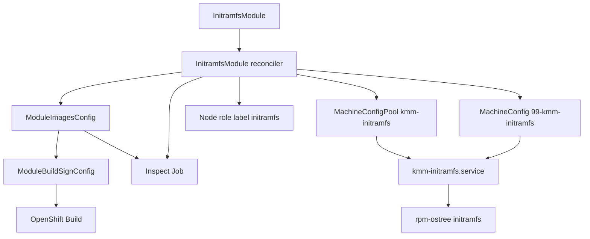
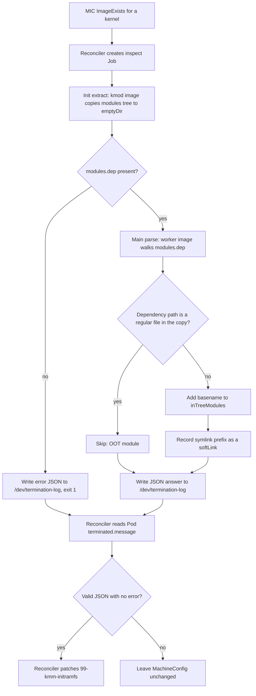
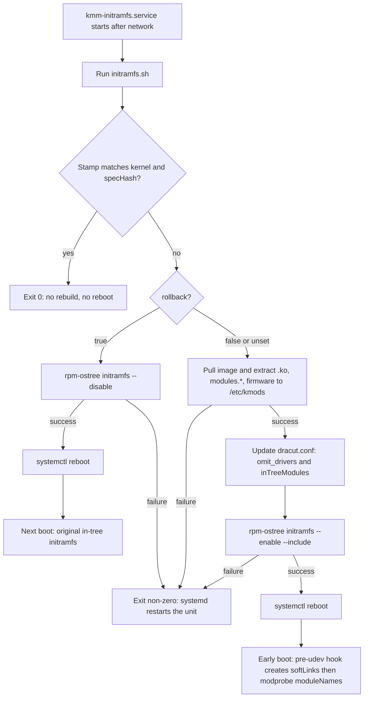

# Initramfs OOT kernel modules

| Field       | Value |
|-------------|-------|
| Author(s)   | Yevgeny Shnaidman |
| Jira        | [MGMT-25378](https://issues.redhat.com/browse/MGMT-25378) |
| PRD         | [prd.md](../../../docs/enhancements/initramfs-oot-modules-MGMT-25378/prd.md) |
| Date        | 2026-09-16 |

# 1. Overview

This design implements [MGMT-25378](https://issues.redhat.com/browse/MGMT-25378): a new namespaced CRD, `InitramfsModule`, that stands alone (no `Module`) and puts out-of-tree (OOT) kernel modules — and their firmware — into the RHCOS initramfs on selected worker nodes. [Locked: D4] [Locked: D16]

On-node work follows the verified PoC: a MachineConfig-installed systemd unit pulls the kmod image, stages files under `/etc/kmods`, runs `rpm-ostree initramfs --enable` with dracut `--include`, and reboots after apply or spec change. In-cluster image build and Secure Boot signing reuse `ModuleImagesConfig` / `ModuleBuildSignConfig` with `InitramfsModule` as owner. This design allows a single `InitramfsModule` in the cluster. A validating webhook rejects a second CREATE; MCP/MC annotation stamps are the backstop if two creates race. One CR can load several OOT modules from one image and omit several in-tree names. After the kmod image exists, an inspect Job copies `modules.dep` from that image; the Job's main container writes JSON `inTreeModules` and `softLinks` to `/dev/termination-log`. The reconciler reads that from Pod status and embeds the lists in the MachineConfig. The CR does not list them. `spec.containerImage` is `<repository>:<partialTag>`; the node script appends `-<kernelVersion>` when pulling. There is no `kernelMappings` field. [User] [Locked: D15] [Codebase: internal/mic/mic.go]

# 2. Goals and Non-Goals

## 2.1 Goals

- Reuse the Module Build/Sign pipeline (MIC + MBSC + DTK `DTK_AUTO`) without creating a `Module`. [Locked: D18]
- Deliver on-node behavior through MachineConfig + systemd, not through a new host agent binary. [User]
- Use one custom MachineConfigPool (PoC pattern: inherit `worker` MachineConfigs, add the initramfs unit) stamped with annotations that name the single `InitramfsModule`. [User]
- Separate staging (`rpm-ostree initramfs --enable`) from reboot so apply and spec-hash changes reboot after `--enable`. Selector-only changes do not patch the MachineConfig. [Locked: D21] [User]
- Report created vs applied on the CR and a scheduling label on the node without requiring the operator to inspect the node. [Locked: D13]

## 2.2 Non-Goals

- Hub / `ManagedClusterModule` for `InitramfsModule` (PRD does not require it).
- PreflightValidation for this CR (FR-12 already allows an in-tree first boot on kernel upgrade).
- Loading these OOT modules again via `NodeModulesConfig` after boot. [Locked: D16]
- More than one `InitramfsModule` in the cluster. A validating webhook rejects a second CREATE. The MCP/MC annotation stamp remains the backstop (concurrent creates, webhook not yet shipped). [User]
- Per-kernel image selection via `kernelMappings`. The node script appends `-<kernelVersion>` to `spec.containerImage` when pulling. [User]
- User-specified `inTreeModules` or `softLinks` on the CR. The inspect Job computes both from `modules.dep` in the kmod image. [User] [Locked: D15]

# 3. Motivation / Background

`Module` loads kmods after the node is up. It cannot replace drivers that already ran inside initramfs (storage and network). This design adds a standalone initramfs path: generate a new initramfs with the OOT modules and reboot onto it.

RHCOS initramfs is an ostree artifact. The PoC showed that `rpm-ostree initramfs --enable` plus dracut `--include` works if files are staged under `/etc` (RHCOS `/opt` is `/var/opt`, and `/var` is not in the ostree checkout dracut uses). This design productizes that mechanism behind a CRD, Build/Sign, selectors, and the delete/deselect/spec-change rules in the PRD.

# 4. Design

## 4.1 Architecture

KMM adds `InitramfsModule` (spoke only). The controller does four jobs: (1) ensure the kmod image exists for targeted node's kernel, (2) after that image is ready, create an inspect Job whose init container copies files from the kmod image and whose main container writes the dependency answer to `/dev/termination-log`, (3) create one custom MachineConfigPool and one MachineConfig for that CR (MachineConfig gets the lists from Pod status), (4) label selected nodes into the pool.



The diagram is the control plane to the host unit. Image build is the existing MIC→MBSC→Build path with `InitramfsModule` as owner instead of `Module`. After MIC reports the image exists, the reconciler creates an inspect Job. That Job copies `modules.dep` from the kmod image, parses it, and leaves a JSON answer in Pod status. The reconciler reads that status and writes `inTreeModules` and `softLinks` into the MachineConfig. MCO delivers the systemd unit, `initramfs.sh`, and the pre-udev hook. The unit runs `initramfs.sh`; that script is the only process that runs `podman`, `rpm-ostree`, and `systemctl reboot`. It does not parse `modules.dep`.

**Custom MCP (PoC / infra pattern):** workers already belong to the `worker` pool. Labeling a node `node-role.kubernetes.io/initramfs=""` and creating pool `kmm-initramfs` with `nodeSelector` on that label **moves MCO management** of that node into the custom pool. The node keeps the `worker` role label. `machineConfigSelector` is `{worker, kmm-initramfs}` so the node still receives every worker MachineConfig plus the initramfs unit. Unset CR selector means all nodes with `node-role.kubernetes.io/worker=""`. [Locked: D17] [User]

KMM always creates MachineConfigPool `kmm-initramfs` and MachineConfig `99-kmm-initramfs`. Both are cluster-scoped, so they cannot have an `ownerReference` to the namespaced `InitramfsModule`. On create, the reconciler stamps each object with these annotations:

| Annotation | Value |
|------------|--------|
| `kmm.sigs.x-k8s.io/initramfsmodule-namespace` | CR namespace |
| `kmm.sigs.x-k8s.io/initramfsmodule-name` | CR name |
| `kmm.sigs.x-k8s.io/initramfsmodule-uid` | CR UID |

Before creating or patching either object, the reconciler GETs both. If either exists and the three annotations do not match this CR, it errors, surfaces the error on the CR, and mutates neither object (no adopt, no overwrite). That covers a user-created pool or MachineConfig with the same name, and a second `InitramfsModule` that passed admission. Matching annotations mean the objects are this CR's; the reconciler may patch their spec. Namespaced children (MIC, inspect Job) still use `ownerReferences`. Kubernetes GC does not delete the MCP or MC when the CR is deleted; the `InitramfsModule` finalizer deletes them. [User]

**Image tag:** `spec.containerImage` is `<repository>:<partialTag>` and does not include the kernel version. The image in the registry is `<repository>:<partialTag>-<kernelVersion>`. Example: field `registry.example.com/kmods/nic:v1` → pull `registry.example.com/kmods/nic:v1-5.14.0-427.el9.x86_64`. The host script appends `-<kernelVersion>`, where `<kernelVersion>` is `uname -r` with every `+` replaced by `-`. The reconciler uses the same rule when ensuring MIC images for selected nodes' kernels. There is no `kernelMappings` field. [User]

**Dependency resolution (inspect Job):** the CR does not carry `inTreeModules` or `softLinks`. After MIC reports `ImageExists` for a selected kernel, the reconciler creates one inspect Job in the CR namespace for that kernel. The Job produces the answer; the reconciler is the only writer of `99-kmm-initramfs`. Rollback skips inspect. [Locked: D15] [User]

**Inspect Job**

| Field | Value |
|-------|--------|
| Kind | `batch/v1` Job (`RestartPolicy: Never`, `backoffLimit: 3`) |
| Name | `irm-inspect-<initramfsmodule-name>-<inputHash>` (DNS-1123; `inputHash` is a short hash of the normalized kernel plus `moduleNames` and `omit`) |
| Namespace | CR namespace |
| Owner | `InitramfsModule` |
| Volume | `emptyDir` named `modules`, mounted by both containers |
| Pull secret | `spec.imageRepoSecret` on the **init** container only (kmod image) |

The Pod has two containers. [User]

| Container | Kind | Image | Command |
|-----------|------|--------|---------|
| `extract` | init container | kmod image: `spec.containerImage` + `-` + normalized kernel | copy the modules tree into the shared `emptyDir` |
| `parse` | main container | KMM worker image (same image as NMC worker pods) | parse `modules.dep` on the `emptyDir` and write the JSON answer to `/dev/termination-log` |

The init container uses the same pull-secret pattern as MIC image-pull pods (`internal/pod/imagepuller.go`). The kmod image must contain `/bin/sh` and `cp` (MIC pull pods already require `/bin/sh`). [Codebase: internal/pod/imagepuller.go] [Codebase: internal/pod/workerpodmanager.go] [User]

`extract` copies `{dirName}/lib/modules/{kernelVersion}/` (`dirName` defaults to `/opt`; `modulesPath` overrides that directory when set) onto the `emptyDir` with `cp -a` so DTK `host` / `kernel` symlinks stay symlinks. If `modules.dep` is missing, it writes `{"error":"missing_modules.dep"}` to `/dev/termination-log` and exits 1; the main container never starts. [User]

`parse` receives `moduleNames`, `omit`, `dirName`, and the kernel version as env/args. It walks `modules.dep` from each `spec.moduleNames` entry (basename match, ignoring `.ko` / `.ko.xz` / `.ko.gz`) and classifies each dependency against the copied tree:

1. **In-tree modules for dracut.** Collect transitive dependencies. A dependency is OOT if its path is a regular file in the copy. A dependency is in-tree if the path is reached through a symlink (`host` / `kernel`) or is otherwise not a regular file in the copy. In-tree names go to `inTreeModules` (dracut `add_drivers`). Names that appear in `spec.moduleNames` or `spec.omit` are not added, so a same-name replace does not pull the omitted in-tree copy back in. [Locked: D15] [User]
2. **Symlinks for the pre-udev hook.** For each in-tree dependency path, take the first path component that is a symlink (for example `host` or `kernel`). Emit one link: `path` = `{dirName}/lib/modules/{kernelVersion}/{prefix}`; `target` = `/lib/modules/{kernelVersion}` when the image symlink points at the whole kernel tree (`host` in `kmod_image.md`), or `/lib/modules/{kernelVersion}/kernel` when the prefix is `kernel` (PoC `ln -sfn`). Duplicate prefixes collapse to one link. If there are no in-tree deps, both lists are empty. [User]

**Answer format (Pod status, not logs):** `parse` writes JSON to `/dev/termination-log` (`terminationMessagePolicy: File`, default) on both success and failure, then exits. Kubernetes copies that file into `status.containerStatuses[].state.terminated.message` (init failures use `initContainerStatuses`). The reconciler reads the Pod object; it does not call `pods/log`. JSON is the wire format (not YAML): it is a single status string with no significant whitespace and unmarshals with Go `encoding/json`. [User]

Success (exit 0):

```json
{
  "inTreeModules": ["crc32"],
  "softLinks": [
    {"path": "/opt/lib/modules/5.14.0-427.el9.x86_64/host", "target": "/lib/modules/5.14.0-427.el9.x86_64"}
  ]
}
```

Failure (non-zero exit), including init `extract`:

```json
{"error":"missing_modules.dep"}
```

Kubelet truncates each termination message at 4096 bytes. A typical OOT graph is a handful of names and fits. If the message is empty, truncated, or not valid JSON, the reconciler treats the Job as failed and does not patch the MachineConfig. [User]

**How results reach the reconciler (not the MachineConfig)**

The Job does **not** patch the MachineConfig. Cluster-scoped MC updates stay in the reconciler so per-kernel Jobs cannot clobber each other or the unit/script payload. [User]

On `Job.Status.Succeeded == 1`, the reconciler reads `parse`'s `terminated.message`, unmarshals the JSON, and patches **only** `99-kmm-initramfs` with those `inTreeModules` and `softLinks` for that kernel. `initramfs.sh` reads the MachineConfig entry for normalized `uname -r`. The MachineConfig is the durable copy of the lists. There is no result ConfigMap and the reconciler does not persist the raw `modules.dep`. Operators can `oc get job`, `oc get pod -o yaml` (terminated message), and `oc get mc 99-kmm-initramfs`. [User]

If a Job for the same `inputHash` already succeeded, the reconciler does not create another; it re-reads that Pod's status if the MachineConfig does not yet have the lists. If `moduleNames` or `omit` change, `inputHash` changes and the reconciler creates a new Job. If MIC/MBSC records a new successful build or sign for that image, the reconciler deletes the old Job and creates a new one. The Job has no `ttlSecondsAfterFinished` so the Pod remains until the owner CR (or a replacement Job) deletes it. [User]

If the Job fails (`error` in the JSON, pull failure, or unreadable status), the reconciler does not write dependency lists into the MachineConfig. Targeted nodes stay on the current initramfs. [Locked: D15] [Locked: D19]

The reconciler does not patch an apply payload into the MachineConfig until every targeted kernel that already has an image has a successful inspect JSON answer. [User]



The diagram is the operator-only path. Copy happens in the init container (kmod image). Parse and JSON answer happen in the main container. The reconciler only reads Pod status and writes the MachineConfig. The host unit never sees `modules.dep`. [User]

**Host unit (`kmm-initramfs.service`):**

1. It is a `Type=simple` unit with `Restart=on-failure` (restart only on failure).
2. It runs after the network is configured, so the node can pull the container image.
3. It runs `initramfs.sh`, which the MachineConfig also delivers.

**`initramfs.sh`:**

If the stamp already matches the current kernel and `specHash`, the script exits 0 (no rebuild, no reboot).

It receives these parameters from the MachineConfig: `rollback`, `containerImage`, `moduleNames`, `firmwarePath`, `modulesPath`, `omit`, `dirName`, `specHash`, and the inspect-Job-computed `inTreeModules` and `softLinks` for the node's kernel. Those last two are not copied from the CR. [User]

If `rollback` is true:

1. It runs `rpm-ostree initramfs --disable`.
2. It reboots the node after `--disable` succeeds.

It does not pull the image or run `--enable` on the rollback path.

If `rollback` is false or unset:

1. It pulls the container image (`spec.containerImage` + `-` + normalized `uname -r`) and extracts the `.ko` files, `modules.*` files, and firmware into `/etc/kmods/...`.
2. It updates dracut config with `omit_drivers` for `omit` and `add_drivers` for the inspect-Job-computed `inTreeModules`.
3. It runs `rpm-ostree initramfs --enable` and uses `--include` to copy the staged files from `/etc/kmods/...` into the new initramfs (including the pre-udev hook).
4. It reboots the node after initramfs creation succeeds.

**Pre-udev hook:** the MachineConfig also delivers a pre-udev hook. `initramfs.sh` includes that hook in the initramfs (`--include`). At early boot the hook creates the inspect-Job-computed soft links so `modprobe` can load in-tree dependencies, then runs `modprobe` for each name in `moduleNames`. [User]

The flowchart is that host sequence: the unit starts after the network, always runs `initramfs.sh`, then either exits, rolls back, or rebuilds and reboots. The pre-udev hook is not part of the unit; it runs from the new initramfs on the next boot after a successful `--enable`. [User]



**Reboot policy:**

| Event | MCO reboot | Stage | KMM `systemctl reboot` |
|-------|------------|--------|------------------------|
| First apply / newly selected | yes (pool join / first MC) | `--enable` after that boot | yes |
| Spec hash change (not rollback) | yes (MC content change) | `--enable` after that boot | yes |
| `rollback: true` | yes (MC content change) | `--disable` after that boot | yes |
| Kernel upgrade, image now present | upgrade reboot | `--enable` | yes |
| Missing image / build failure / missing firmware or `modules.*` / missing `modules.dep` | no extra | do nothing | no (poll / exit non-zero, unit restarts) |
| Deselect | no (selector does not patch the MC) | do not `--disable` | no |
| Delete CR | MCO may reboot when MC/MCP is removed | do not `--disable` | no |

**Note:** A selector-only change does not patch `99-kmm-initramfs`. Nodes that no longer match `spec.selector` lose the `kmm-initramfs` role label and leave the custom pool, so they receive no further updates from that MachineConfig. They keep the initramfs already on the node (the last `--enable` result). They do not revert to the original in-tree initramfs. To revert while a node is still selected, set `spec.rollback` to true. [User]

**Created vs applied:** a status pod (privileged, hostPath `/var/opt/kmods`, NMC-style) reads the stamp. It patches:

- CR `status.nodes[]`: `initramfsCreated`, `initramfsApplied`, `kernelVersion`
- Node labels: `kmm.node.kubernetes.io/initramfs.<ns>.<name>=""` when the CR is applied on the current kernel (FR-17). Removed on deselect, delete, and during the in-tree window after a kernel upgrade until applied again.

Created means `--enable` succeeded (stamp written). Applied means the node is Ready, `BootID` differs from the BootID recorded at created, and stamp kernel equals `node.Status.NodeInfo.KernelVersion`. If the node reboots before the status pod runs, both become true on the first post-reboot observation (allowed by D13). After a successful rollback, `initramfsApplied` is false and the FR-17 label is removed. [Locked: D13] [Codebase: internal/node/node.go]

**MachineConfig updates:** this feature does not set `NodeDisruptionPolicy` `None`. A change to `99-kmm-initramfs` uses the MCO default: drain and reboot so the new unit, `initramfs.sh`, pre-udev hook, and embedded config are on the node and `kmm-initramfs.service` runs after that boot. There is no systemd path unit. Selector-only changes do not patch the MachineConfig, so they do not cause this MCO reboot. See the Note above for deselect. [User]

## 4.2 Data Model / Schema Changes

New namespaced CRD `InitramfsModule` (`irm`) in `kmm.sigs.x-k8s.io/v1beta1`. Additive; no change to `Module`.

```go
type InitramfsModuleSpec struct {
    // Empty or nil: all nodes with label node-role.kubernetes.io/worker="".
    Selector map[string]string `json:"selector,omitempty"`

    // ModuleNames are the OOT kernel modules to extract and load
    // (.ko basename without .ko). The pre-udev hook modprobes each name
    // in list order. At least one is required. [User]
    // +kubebuilder:validation:MinItems=1
    ModuleNames []string `json:"moduleNames"`

    // Omit is the list of in-tree kernel module names passed to dracut
    // omit_drivers. Use this to replace in-tree drivers (FR-7). [User]
    // +optional
    Omit []string `json:"omit,omitempty"`

    // ContainerImage is the OOT kmod image without the kernel-version
    // suffix: <repository>:<partialTag>.
    // The image pulled or built for a node is
    // <repository>:<partialTag>-<kernelVersion>, where <kernelVersion> is
    // uname -r with every '+' replaced by '-'.
    // Example: registry.example.com/kmods/nic:v1 →
    // registry.example.com/kmods/nic:v1-5.14.0-427.el9.x86_64.
    // The host script appends "-"+kernelVersion when pulling.
    // There is no kernelMappings field. [User]
    ContainerImage string `json:"containerImage"`

    FirmwarePath string `json:"firmwarePath,omitempty"` // firmware directory inside the image
    ModulesPath  string `json:"modulesPath,omitempty"`  // directory in the image that contains modules.*
    DirName      string `json:"dirName,omitempty"`      // default /opt

    Build *Build `json:"build,omitempty"` // same type as Module
    Sign  *Sign  `json:"sign,omitempty"`  // same type as Module; runs when set

    ImageRepoSecret *corev1.LocalObjectReference `json:"imageRepoSecret,omitempty"`

    // Rollback, when true, reverts targeted nodes to the original in-tree
    // initramfs: initramfs.sh runs rpm-ostree initramfs --disable and reboots.
    // The node must still match spec.selector so it receives the MachineConfig.
    // [User]
    // +optional
    Rollback bool `json:"rollback,omitempty"`
}

// SoftLink is written into the MachineConfig from the inspect Job JSON. It is not a spec field.
type SoftLink struct {
    Path   string `json:"path"`   // path of the link in initramfs
    Target string `json:"target"` // link target
}

type InitramfsNodeStatus struct {
    Name              string `json:"name"`
    KernelVersion     string `json:"kernelVersion,omitempty"`
    InitramfsCreated  bool   `json:"initramfsCreated"`
    InitramfsApplied  bool   `json:"initramfsApplied"`
}

type InitramfsModuleStatus struct {
    Nodes []InitramfsNodeStatus `json:"nodes,omitempty"`
}
```

MIC name: `irm-<initramfsmodule-name>` in the CR namespace, ownerRef = `InitramfsModule`, so it does not collide with a `Module` of the same name. MIC `images` are `spec.containerImage` + `-` + normalized kernel for each unique selected-node kernel. `spec.build` / `spec.sign` apply to every such image. [Codebase: internal/mic/mic.go]

Parameters for `initramfs.sh` are embedded in the MachineConfig (`rollback`, `containerImage`, `moduleNames`, `firmwarePath`, `modulesPath`, `omit`, `dirName`, `specHash`, plus inspect-Job-computed `inTreeModules` and `softLinks` keyed by kernel version). `specHash` covers the spec fields that affect initramfs content (`moduleNames`, `omit`, `containerImage`, `firmwarePath`, `modulesPath`, `dirName`, `build`, `sign`, `rollback`) and the computed dependency lists. Selector-only changes do not change `specHash` and do not patch the MachineConfig.

Namespaced children of the `InitramfsModule` use `ownerReferences` (MIC, inspect Job). Cluster-scoped MCP and MC use the annotations in §4.1; they have no `ownerReference` to the CR. [User]

| Object | Name | Notes |
|--------|------|--------|
| MachineConfigPool | `kmm-initramfs` | Always created by KMM. Stamped with the three `initramfsmodule-*` annotations. `nodeSelector` = `node-role.kubernetes.io/initramfs: ""`; `machineConfigSelector` role in `{worker, kmm-initramfs}`; `maxUnavailable: 1`. If the name already exists and is not stamped for this CR, reconcile errors (no adopt, no overwrite). [User] |
| MachineConfig | `99-kmm-initramfs` | Same annotation stamp as the pool. Label `machineconfiguration.openshift.io/role: kmm-initramfs`; embeds inspect-Job-computed per-kernel `inTreeModules` and `softLinks`; content changes reboot via default MCO policy. If the name already exists and is not stamped for this CR, reconcile errors (no adopt, no overwrite). [User] |
| Job | `irm-inspect-<name>-<inputHash>` | namespaced; `ownerReference` to the CR; two-container extract/parse Job; JSON answer in Pod `terminated.message`; does not patch the MachineConfig |

The reconciler sets `node-role.kubernetes.io/initramfs=""` on nodes matching `spec.selector` and removes it on deselect. Node matching uses `selector` only; there is no `tolerations` field. [User]

## 4.3 API Changes

Additive CRD. Validating webhook (`/validate-kmm-sigs-x-k8s-io-v1beta1-initramfsmodule`):

- `moduleNames` required; at least one entry; entries unique; each is a kernel-module name (`[A-Za-z0-9_-]+`).
- `omit` optional; entries unique; each the same name form as `moduleNames`.
- There are no `inTreeModules` or `softLinks` spec fields. [User] [Locked: D15]
- `containerImage` required; form `<repository>:<partialTag>` (includes a tag; does not include the kernel version). The node script appends `-<kernelVersion>` when pulling.
- `rollback` optional boolean. When true, targeted nodes `--disable` and reboot; `initramfs.sh` does not pull or `--enable`.
- `build` / `sign` follow the same rules as Module (sign `filesToSign` under `dirName`).
- If `build` is unset and the image is missing, the node waits (FR-13); the webhook does not require `build`.
- On CREATE, at most one `InitramfsModule` may exist in the cluster (any namespace). [User]
- There is no `kernelMappings` field. [User]

**Singleton validating webhook:** served by `cmd/webhook-server` with the existing Module / PreflightValidation webhooks (`internal/webhook`, `failurePolicy: Fail`, `sideEffects: None`). Path `/validate-kmm-sigs-x-k8s-io-v1beta1-initramfsmodule`. [Codebase: internal/webhook/module.go] [Codebase: cmd/webhook-server/main.go] [User]

On CREATE, the webhook lists `InitramfsModule` in all namespaces. If any object already exists, it rejects with a message that names the existing `namespace/name`. On UPDATE, it lists again and rejects only if another object (different namespace or name) exists; updates of the admitted CR are allowed. DELETE is not validated. The list is a read against the API server (or the webhook manager cache if that type is watched). It does not create or mutate objects. [User]

A list does not close a concurrent-create race: two CREATE requests can both see zero objects and both be admitted. The first reconciler to stamp `kmm-initramfs` and `99-kmm-initramfs` wins; the other sees annotations that are not its own and errors. If the list call fails, `failurePolicy: Fail` rejects the CREATE. [User]

**Implementation order:** the singleton webhook is required, but it is **lower priority** than the rest of this feature. Implement the CRD, reconciler (MIC, inspect Job, MCP/MC, host unit, status) first. Add the singleton webhook after that path works. Until the webhook ships, the MCP/MC annotation stamp is the only enforcement: a second CR is admitted and reconcile errors. Field validation on the same webhook (moduleNames, omit, containerImage, sign paths) ships with the CRD; only the cluster-wide list check is deferred. [User]

Example:

```yaml
apiVersion: kmm.sigs.x-k8s.io/v1beta1
kind: InitramfsModule
metadata:
  name: nic-oot
  namespace: openshift-kmm
spec:
  selector:
    node-role.kubernetes.io/worker: ""
  moduleNames:
    - my-nic
    - my-nic-helper
  omit:
    - my-nic
  containerImage: registry.example.com/kmods/nic:v1
  firmwarePath: /firmware
  modulesPath: /opt/lib/modules
  rollback: false
  build:
    dockerfileConfigMap:
      name: nic-dockerfile
  sign:
    keySecret:
      name: secureboot-key
    certSecret:
      name: secureboot-cert
    filesToSign:
      - /opt/lib/modules/${KERNEL_FULL_VERSION}/extra/my-nic.ko
      - /opt/lib/modules/${KERNEL_FULL_VERSION}/extra/my-nic-helper.ko
```

`oc apply` / `oc delete` and the OpenShift console use the CRD + CSV `displayName: Initramfs Module`. [Locked: D11]

## 4.4 Scalability and Performance

Work is per selected node, not per pod replica. Typical scale is tens to low hundreds of workers. Each node: one image pull, one `rpm-ostree initramfs --enable` (dracut, minutes). The operator runs one two-container inspect Job per unique selected kernel and `moduleNames`/`omit` set (not per node). First apply, spec-hash changes, and `rollback: true` each cause an MCO reboot (MachineConfig change) and then a KMM reboot after `--enable` or `--disable`. CPU/memory on the operator are comparable to Module (one MIC, listing nodes, plus one Job per kernel). Host disk: staged copies under `/etc/kmods` plus ostree pending deployment. Stamp + `specHash` prevent reboot loops. `maxUnavailable: 1` on the MCP serializes MCO admission to the pool.

## 4.5 Security Considerations

The host unit runs as root and uses the kubelet pull secret. The inspect Job init container pulls the kmod image with `spec.imageRepoSecret` (same secret as MIC pull pods). The main container uses the KMM worker image. Signing uses the same key/cert secrets as Module; enrollment in MOK remains the operator's existing Secure Boot process. Privileged status pods use the same worker SCC pattern as NMC. Webhook validates sign paths and, when the singleton check ships, lists `InitramfsModule` objects (read-only). No new authentication model.

## 4.6 Failure Handling and Recovery

| Failure | Behavior | Operator-visible |
|---------|----------|------------------|
| Image missing, no build | Unit polls pull; no `--enable`, no reboot | `initramfsCreated=false`, `initramfsApplied=false` |
| Build/sign failure | MIC/MBSC Failure; unit keeps polling | same; MBSC status Success/Failure as today |
| `modules.dep` missing in the kmod image | init container writes `{"error":"missing_modules.dep"}` to `/dev/termination-log` and exits 1; reconciler does not patch dependency lists into the MC | created false |
| Inspect Job pull/registry failure | Job retries up to `backoffLimit`; no apply payload on the MC | created false; reconcile waits |
| Pod `terminated.message` empty, truncated, or not valid JSON | do not patch apply payload into the MC; keep the Job | created false; reconcile retries |
| `modules.*` or any `moduleNames` `.ko` missing after extract | unit fails, Restart=on-failure; no `--enable` | created false |
| Firmware path set but empty in image | treat as cannot place firmware; no `--enable` [Locked: D19] | created false |
| `rpm-ostree` busy | wait idle, retry as in PoC (30×20s) | created false until success |
| `rpm-ostree initramfs --disable` fails | unit fails, Restart=on-failure; no reboot | `initramfsApplied` stays true until success |
| Node NotReady during MCO reboot | wait; unit runs when network-online | applied after Ready + BootID change |
| Delete during pending `--enable` | finalizer removes MC/MCP (no GC via `ownerReference`); does not `--disable` | status nodes list shrinks; OOT initramfs remains |
| `MachineConfigPool` `kmm-initramfs` or `MachineConfig` `99-kmm-initramfs` exists and is not stamped for this CR | do not create, adopt, or patch MCP or MC | reconcile error on the CR; no MCP/MC changes from this reconcile |
| Second `InitramfsModule` CREATE (webhook shipped) | webhook rejects; object is not persisted | `oc apply` error naming the existing `namespace/name` |
| Webhook singleton list fails | `failurePolicy: Fail` rejects the CREATE | `oc apply` error |

Idempotency: stamp == current kver + spec hash → exit 0 (FR-18).

## 4.7 RBAC / Tenancy

`InitramfsModule` is namespaced. Any user who can create it in a namespace can target cluster nodes via `selector` (same as `Module`). Manager ClusterRole gains: CRUD `initramfsmodules` + status; existing MIC/MBSC/Build; MachineConfig, MachineConfigPool; node label patch; `batch/jobs` create/get/list/watch/delete. Existing `pods` get/list/watch is enough to read `terminated.message`; this feature does not need `pods/log`. The webhook server ClusterRole gains cluster-wide `get`/`list` on `initramfsmodules` for the singleton check (same SA pattern as `cmd/webhook-server` today). No new tenant isolation model.

## 4.8 Extensibility / Future-Proofing

`Build` and `Sign` types are shared with Module, so new build fields apply here without a parallel API. A later hub ManifestWork can wrap `InitramfsModule` the same way it wraps `Module`; this design does not add that. `moduleNames` and `omit` are lists, so adding another kmod from the same image is a spec edit, not a CRD change. In-tree dependency lists stay computed from `modules.dep`, so a new DTK-resolved dependency does not require a CRD change. Module-style `spec.tolerations` can be added later as an additive field. Supporting more than one `InitramfsModule` (union of `--include`s, one custom pool) is out of scope; adding it later is an additive controller change, not a CRD break.

# 5. Interface Changes

## IC-1: InitramfsModule create, update, delete

**Requirements:** FR-1, FR-2

Namespaced CR `InitramfsModule` (`irm`) in `kmm.sigs.x-k8s.io/v1beta1`. Create, update, and delete via `oc` and the OpenShift console. No `Module` is required. A second CREATE in the cluster is rejected by the validating webhook (implemented after the reconciler path). See §4.3.

## IC-2: InitramfsModule spec (selector, moduleNames, omit, image, build, sign, firmware, rollback)

**Requirements:** FR-3, FR-4, FR-5, FR-6, FR-7, FR-8, FR-9, NFR-2

Fields in §4.2. Unset `selector` targets `node-role.kubernetes.io/worker=""`. `moduleNames` lists OOT `.ko` files to extract and load. `omit` lists in-tree names for `omit_drivers`. There are no `inTreeModules` or `softLinks` spec fields; the inspect Job computes those from `modules.dep` and the reconciler writes them into the MachineConfig (IC-5, FR-10). `containerImage` is `<repository>:<partialTag>`; `initramfs.sh` appends `-<kernelVersion>` when pulling. `build` triggers MIC/MBSC when the tagged image is missing. `sign` uses the Module sign Dockerfile. `firmwarePath` and `modulesPath` are in-image directories to extract. `rollback: true` makes `initramfs.sh` run `rpm-ostree initramfs --disable` and reboot on still-selected nodes.

## IC-3: InitramfsModule status created / applied per node

**Requirements:** FR-16, NFR-3

`status.nodes[]` with `initramfsCreated` and `initramfsApplied`. Visible with `oc get initramfsmodule -o yaml` / console.

## IC-4: Node scheduling label after apply

**Requirements:** FR-17

Label `kmm.node.kubernetes.io/initramfs.<namespace>.<name>=""` on the node after applied. Workloads can `nodeSelector` on it. Removed on deselect, delete, and until re-apply after kernel upgrade.

## IC-5: MachineConfig `99-kmm-initramfs` and MachineConfigPool `kmm-initramfs`

**Requirements:** FR-10, FR-11, FR-18, FR-19, FR-20, FR-21

Cluster-scoped objects operators can `oc get`. KMM always creates MachineConfigPool `kmm-initramfs` and MachineConfig `99-kmm-initramfs` and stamps both with `kmm.sigs.x-k8s.io/initramfsmodule-{namespace,name,uid}`. They have no `ownerReference` to the namespaced CR. If either name already exists and is not stamped for this `InitramfsModule`, reconciliation errors and does not adopt or overwrite. The MachineConfig installs `kmm-initramfs.service`, `initramfs.sh`, and the pre-udev hook, and embeds the inspect-Job-computed per-kernel `inTreeModules` and `softLinks`. Those lists come from the inspect Job's JSON answer in Pod `terminated.message`; the Job never patches the MachineConfig. A MachineConfig content change reboots the node (MCO default). Selector-only changes do not patch the MachineConfig. Not a user-facing API for creating MCs or MCPs by hand. [User]

FR-12, FR-13, FR-14, FR-15, NFR-1 are host and wait-state behavior exercised through IC-1–IC-5 (two-reboot upgrade, wait without reboot, delete leaves current initramfs). They add no further interface objects.

# 6. Alternatives Considered

**Privileged worker pod runs dracut instead of systemd.** Rejected: the PoC and D7 use a systemd unit set on the node. A pod cannot run reliably before kubelet after the initramfs reboot the unit is meant to prepare.

**Union MCP / multi-CR `--enable` merge.** Not used: this design allows a single `InitramfsModule`. A second CREATE is rejected by the validating webhook. [User]

**Reconciler-only singleton (no webhook).** Rejected as the user-facing gate: the second CR would be admitted and sit in Error. MCP/MC annotation stamps stay as the backstop for races and for the window before the webhook ships. [User]

**Cluster-scoped CR with a fixed name.** Rejected: `InitramfsModule` stays namespaced like `Module`. Uniqueness is the webhook list plus MCP/MC annotation stamps. [User]

**`ownerReferences` from MCP/MC to `InitramfsModule`.** Rejected: a cluster-scoped object cannot list a namespaced owner. The API server rejects that reference. Annotations carry the CR identity; the finalizer deletes the objects. [User]

**Adopt a pre-existing user MachineConfigPool named `kmm-initramfs`.** Rejected: KMM always creates the pool. If one already exists and is not stamped for this CR, reconciliation errors. Same rule for `99-kmm-initramfs`. [User]

**`kernelMappings` like Module.** Rejected: the pulled image is `spec.containerImage` + `-<kernelVersion>`, so per-kernel mappings are unnecessary. [User]

**Module-style `spec.tolerations`.** Not used: node targeting is the selector only. [User]

**Infer `omit_drivers` from `moduleNames`.** Rejected: omit is an explicit list so replace (FR-7) and add (FR-8) stay distinct, and in-tree names may differ from OOT names. [User]

**User lists `inTreeModules` and `softLinks` on the CR.** Rejected: D15 requires in-tree deps from `modules.dep` without the user naming them. The inspect Job computes both lists; the reconciler embeds them in the MachineConfig. [User] [Locked: D15]

**`initramfs.sh` parses `modules.dep` on the node.** Rejected: the inspect Job computes `inTreeModules` and `softLinks` before the MachineConfig is applied; the host unit only consumes those lists. [User]

**Reconciler parses `modules.dep`.** Rejected: the Job main container parses the copy on the `emptyDir` and writes the JSON answer; the reconciler only unmarshals Pod status. [User]

**Single-container Job whose image is the kmod image.** Rejected: the kmod image only copies the modules tree; parse runs in the KMM worker image. [User]

**In-process registry extract from the manager pod.** Rejected: extract uses a Job whose init container image is the kmod image, same pull-secret pattern as MIC pull pods, so registry access matches workload pull rather than the manager's network path. [User]

**Inspect Job patches `99-kmm-initramfs` directly.** Rejected: the reconciler is the single writer of the MachineConfig so per-kernel Jobs cannot clobber the unit/script payload or each other's kernel keys. The JSON answer is Pod status; computed lists go on the MC. [User]

**Persist raw `modules.dep` in a ConfigMap.** Rejected: the answer is JSON in `/dev/termination-log` / Pod status. The MachineConfig is the durable copy of the lists. [User]

**YAML for the termination-log answer.** Rejected: JSON is the wire format so the status string has no significant whitespace and unmarshals with `encoding/json`. [User]

**Read inspect output from container logs (`pods/log`).** Rejected: the answer is the termination message on Pod status. [User]

**NodeDisruptionPolicy `None` plus a systemd path unit.** Rejected: a MachineConfig update must run the new unit, not only write files. Default MCO reboot applies the change and starts the service after boot. [User]

**Always `systemctl reboot` after `--enable` (PoC).** Rejected for deselect: a selector-only change must not KMM-reboot the node (FR-20). It also does not patch the MachineConfig.

# 7. Observability and Monitoring

- Reconciler logs: targeted nodes, MIC image state, inspect Job name/status, JSON `inTreeModules` and `softLinks` read from Pod `terminated.message`, MCP/MC create (or conflict if `kmm-initramfs` or `99-kmm-initramfs` already exists and is not stamped for this CR).
- Webhook logs: rejected second CREATE, including the existing `namespace/name`.
- Host unit stdout (journald `kmm-initramfs.service`): `initramfs.sh` pull, extract, `rpm-ostree --enable` / `--disable`, reboot.
- No new Prometheus metrics. Created/applied on the CR is the operator-facing signal. [Locked: D13]

# 8. Impact and Compatibility

- Additive CRD, webhook, RBAC, CSV entry. Existing Module behavior unchanged.
- KMM always creates MCP `kmm-initramfs` and MC `99-kmm-initramfs` with the `initramfsmodule-*` annotations. If either name already exists and is not stamped for this CR (user-created, or stamped for another object), the reconciler errors and surfaces it on the CR. It does not adopt or overwrite. [User]
- A second `InitramfsModule` CREATE is rejected by the validating webhook once that check ships. Until then, and for a concurrent-create race, the extra CR's reconcile errors because `kmm-initramfs` or `99-kmm-initramfs` already exists and is not stamped for it. [User]
- Nodes labeled into the pool undergo MCO reboot on first join. Later MachineConfig content changes also MCO-reboot those nodes (default disruption policy). [User]
- After delete, leftover OOT initramfs remains until the next kernel/ostree upgrade. Document this (PRD risk 6.1).
- After deselect, leftover OOT initramfs also remains: those nodes have left the custom pool and do not receive MachineConfig updates, so they do not revert to the original in-tree initramfs. Set `spec.rollback: true` while the node is still selected to `--disable` and reboot onto the original initramfs. [User]
