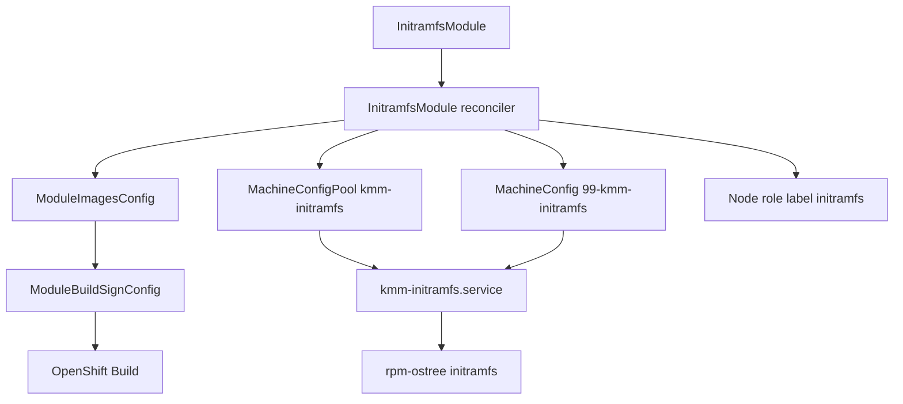
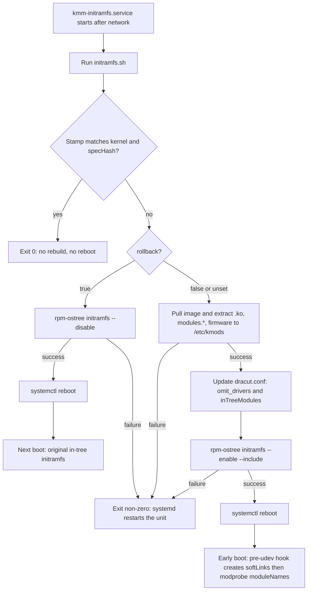

# Initramfs OOT kernel modules

| Field       | Value |
|-------------|-------|
| Author(s)   | Yevgeny Shnaidman |
| Jira        | [MGMT-25378](https://issues.redhat.com/browse/MGMT-25378) |
| PRD         | [prd.md](../../../docs/enhancements/initramfs-oot-modules-MGMT-25378/prd.md) |
| Date        | 2026-09-10 |

# 1. Overview

This design implements [MGMT-25378](https://issues.redhat.com/browse/MGMT-25378): a new namespaced CRD, `InitramfsModule`, that stands alone (no `Module`) and puts out-of-tree (OOT) kernel modules — and their firmware — into the RHCOS initramfs on selected worker nodes. [Locked: D4] [Locked: D16]

On-node work follows the verified PoC: a MachineConfig-installed systemd unit pulls the kmod image, stages files under `/etc/kmods`, runs `rpm-ostree initramfs --enable` with dracut `--include`, and reboots after apply or spec change. In-cluster image build and Secure Boot signing reuse `ModuleImagesConfig` / `ModuleBuildSignConfig` with `InitramfsModule` as owner. This design assumes a single `InitramfsModule` in the cluster; KMM does not reject a second object. One CR can load several OOT modules from one image and omit several in-tree names. `spec.containerImage` is `<repository>:<partialTag>`; the node script appends `-<kernelVersion>` when pulling. There is no `kernelMappings` field. [User] [Codebase: internal/mic/mic.go]

# 2. Goals and Non-Goals

## 2.1 Goals

- Reuse the Module Build/Sign pipeline (MIC + MBSC + DTK `DTK_AUTO`) without creating a `Module`. [Locked: D18]
- Deliver on-node behavior through MachineConfig + systemd, not through a new host agent binary. [User]
- Use one custom MachineConfigPool (PoC pattern: inherit `worker` MachineConfigs, add the initramfs unit) owned by the single `InitramfsModule`. [User]
- Separate staging (`rpm-ostree initramfs --enable`) from reboot so apply and spec-hash changes reboot after `--enable`. Selector-only changes do not patch the MachineConfig. [Locked: D21] [User]
- Report created vs applied on the CR and a scheduling label on the node without requiring the operator to inspect the node. [Locked: D13]

## 2.2 Non-Goals

- Hub / `ManagedClusterModule` for `InitramfsModule` (PRD does not require it).
- PreflightValidation for this CR (FR-12 already allows an in-tree first boot on kernel upgrade).
- Loading these OOT modules again via `NodeModulesConfig` after boot. [Locked: D16]
- More than one `InitramfsModule` in the cluster. Operators must not create a second one. KMM does not admit, reject, or reconcile uniqueness. [User]
- Per-kernel image selection via `kernelMappings`. The node script appends `-<kernelVersion>` to `spec.containerImage` when pulling. [User]
- `spec.tolerations`. Node targeting is the selector only. [User]

# 3. Motivation / Background

`Module` loads kmods after the node is up. It cannot replace drivers that already ran inside initramfs (storage and network). This design adds a standalone initramfs path: generate a new initramfs with the OOT modules and reboot onto it.

RHCOS initramfs is an ostree artifact. The PoC showed that `rpm-ostree initramfs --enable` plus dracut `--include` works if files are staged under `/etc` (RHCOS `/opt` is `/var/opt`, and `/var` is not in the ostree checkout dracut uses). This design productizes that mechanism behind a CRD, Build/Sign, selectors, and the delete/deselect/spec-change rules in the PRD.

# 4. Design

## 4.1 Architecture

KMM adds `InitramfsModule` (spoke only). The controller does three jobs: (1) ensure the kmod image exists for targeted node's kernel, (2) keep one custom MachineConfigPool and one MachineConfig for that CR, (3) label selected nodes into the pool.



The diagram is the control plane to the host unit. Image build is the existing MIC→MBSC→Build path with `InitramfsModule` as owner instead of `Module`. MCO delivers the systemd unit, `initramfs.sh`, and the pre-udev hook. The unit runs `initramfs.sh`; that script is the only process that runs `podman`, `rpm-ostree`, and `systemctl reboot`.

**Custom MCP (PoC / infra pattern):** workers already belong to the `worker` pool. Labeling a node `node-role.kubernetes.io/initramfs=""` and creating pool `kmm-initramfs` with `nodeSelector` on that label **moves MCO management** of that node into the custom pool. The node keeps the `worker` role label. `machineConfigSelector` is `{worker, kmm-initramfs}` so the node still receives every worker MachineConfig plus the initramfs unit. Unset CR selector means all nodes with `node-role.kubernetes.io/worker=""`. [Locked: D17] [User]

**Image tag:** `spec.containerImage` is `<repository>:<partialTag>` and does not include the kernel version. The image in the registry is `<repository>:<partialTag>-<kernelVersion>`. Example: field `registry.example.com/kmods/nic:v1` → pull `registry.example.com/kmods/nic:v1-5.14.0-427.el9.x86_64`. The host script appends `-<kernelVersion>`, where `<kernelVersion>` is `uname -r` with every `+` replaced by `-`. The reconciler uses the same rule when ensuring MIC images for selected nodes' kernels. There is no `kernelMappings` field. [User]

**Host unit (`kmm-initramfs.service`):**

1. It is a `Type=simple` unit with `Restart=on-failure` (restart only on failure).
2. It runs after the network is configured, so the node can pull the container image.
3. It runs `initramfs.sh`, which the MachineConfig also delivers.

**`initramfs.sh`:**

If the stamp already matches the current kernel and `specHash`, the script exits 0 (no rebuild, no reboot).

It receives these parameters from the MachineConfig (copied from the CR): `rollback`, the `.ko` files to extract (`moduleNames`), the firmware directory to extract (`firmwarePath`), the `modules.*` directory to extract (`modulesPath`), which in-tree kernel modules to add into initramfs for dependencies (`inTreeModules`), which soft links to create in initramfs so `modprobe` can load those dependencies (`softLinks`), and which in-tree kernel modules to omit (`omit`).

If `rollback` is true:

1. It runs `rpm-ostree initramfs --disable`.
2. It reboots the node after `--disable` succeeds.

It does not pull the image or run `--enable` on the rollback path.

If `rollback` is false or unset:

1. It pulls the container image (`spec.containerImage` + `-` + normalized `uname -r`) and extracts the `.ko` files, `modules.*` files, and firmware into `/etc/kmods/...`.
2. It updates dracut config with `omit_drivers` for `omit` and, when `inTreeModules` is set, adds those in-tree modules.
3. It runs `rpm-ostree initramfs --enable` and uses `--include` to copy the staged files from `/etc/kmods/...` into the new initramfs (including the pre-udev hook).
4. It reboots the node after initramfs creation succeeds.

**Pre-udev hook:** the MachineConfig also delivers a pre-udev hook. `initramfs.sh` includes that hook in the initramfs (`--include`). At early boot the hook creates the configured soft links so `modprobe` can load in-tree dependencies, then runs `modprobe` for each name in `moduleNames`. [User]

The flowchart is that host sequence: the unit starts after the network, always runs `initramfs.sh`, then either exits, rolls back, or rebuilds and reboots. The pre-udev hook is not part of the unit; it runs from the new initramfs on the next boot after a successful `--enable`. [User]



**Reboot policy:**

| Event | MCO reboot | Stage | KMM `systemctl reboot` |
|-------|------------|--------|------------------------|
| First apply / newly selected | yes (pool join / first MC) | `--enable` after that boot | yes |
| Spec hash change (not rollback) | yes (MC content change) | `--enable` after that boot | yes |
| `rollback: true` | yes (MC content change) | `--disable` after that boot | yes |
| Kernel upgrade, image now present | upgrade reboot | `--enable` | yes |
| Missing image / build failure / missing firmware or `modules.*` | no extra | do nothing | no (poll / exit non-zero, unit restarts) |
| Deselect | no (selector does not patch the MC) | do not `--disable` | no |
| Delete CR | MCO may reboot when MC/MCP is removed | do not `--disable` | no |

**Note:** A selector-only change does not patch `99-kmm-initramfs`. Nodes that no longer match `spec.selector` lose the `kmm-initramfs` role label and leave the custom pool, so they receive no further updates from that MachineConfig. They keep the initramfs already on the node (the last `--enable` result). They do not revert to the original in-tree initramfs. To revert while a node is still selected, set `spec.rollback` to true. [User]

**Created vs applied:** a status pod (privileged, hostPath `/var/opt/kmods`, NMC-style) reads the stamp. It patches:

- CR `status.nodes[]`: `initramfsCreated`, `initramfsApplied`, `kernelVersion`
- Node labels: `kmm.node.kubernetes.io/initramfs.<ns>.<name>=""` when the CR is applied on the current kernel (FR-17). Removed on deselect, delete, and during the in-tree window after a kernel upgrade until applied again.

Created means `--enable` succeeded (stamp written). Applied means the node is Ready, `BootID` differs from the BootID recorded at created, and stamp kernel equals `node.Status.NodeInfo.KernelVersion`. If the node reboots before the status pod runs, both become true on the first post-reboot observation (allowed by D13). After a successful rollback, `initramfsApplied` is false and the FR-17 label is removed. [Locked: D13] [Codebase: internal/node/node.go]

**MachineConfig updates:** this feature does not set `NodeDisruptionPolicy` `None`. A change to `99-kmm-initramfs` uses the MCO default: drain and reboot so the new unit, `initramfs.sh`, pre-udev hook, and embedded config are on the node and `kmm-initramfs.service` runs after that boot. There is no systemd path unit. Selector-only changes do not patch the MachineConfig, so they do not cause this MCO reboot. See the Note above for deselect. [User]

## 4.2 Data Model / Schema Changes

New namespaced CRD `InitramfsModule` (`irm`) in `kmm.sigs.x-k8s.io/v1beta1`. Additive; no change to `Module`.

```go
type InitramfsModuleSpec struct {
    // Empty or nil: all nodes with label node-role.kubernetes.io/worker="".
    Selector map[string]string `json:"selector,omitempty"`

    // ModuleNames are the OOT kernel modules to extract and load
    // (.ko basename without .ko). The pre-udev hook modprobes each name
    // in list order. At least one is required. [User]
    // +kubebuilder:validation:MinItems=1
    ModuleNames []string `json:"moduleNames"`

    // Omit is the list of in-tree kernel module names passed to dracut
    // omit_drivers. Use this to replace in-tree drivers (FR-7). [User]
    // +optional
    Omit []string `json:"omit,omitempty"`

    // InTreeModules are in-tree kernel modules to add into initramfs
    // when the OOT module depends on them. [User]
    // +optional
    InTreeModules []string `json:"inTreeModules,omitempty"`

    // SoftLinks are symlinks to create in initramfs so modprobe can
    // load in-tree dependencies. [User]
    // +optional
    SoftLinks []SoftLink `json:"softLinks,omitempty"`

    // ContainerImage is the OOT kmod image without the kernel-version
    // suffix: <repository>:<partialTag>.
    // The image pulled or built for a node is
    // <repository>:<partialTag>-<kernelVersion>, where <kernelVersion> is
    // uname -r with every '+' replaced by '-'.
    // Example: registry.example.com/kmods/nic:v1 →
    // registry.example.com/kmods/nic:v1-5.14.0-427.el9.x86_64.
    // The host script appends "-"+kernelVersion when pulling.
    // There is no kernelMappings field. [User]
    ContainerImage string `json:"containerImage"`

    FirmwarePath string `json:"firmwarePath,omitempty"` // firmware directory inside the image
    ModulesPath  string `json:"modulesPath,omitempty"`  // directory in the image that contains modules.*
    DirName      string `json:"dirName,omitempty"`      // default /opt

    Build *Build `json:"build,omitempty"` // same type as Module
    Sign  *Sign  `json:"sign,omitempty"`  // same type as Module; runs when set

    ImageRepoSecret *corev1.LocalObjectReference `json:"imageRepoSecret,omitempty"`

    // Rollback, when true, reverts targeted nodes to the original in-tree
    // initramfs: initramfs.sh runs rpm-ostree initramfs --disable and reboots.
    // The node must still match spec.selector so it receives the MachineConfig.
    // [User]
    // +optional
    Rollback bool `json:"rollback,omitempty"`
}

// SoftLink is a symlink created in initramfs for in-tree dependency lookup.
type SoftLink struct {
    Path   string `json:"path"`   // path of the link in initramfs
    Target string `json:"target"` // link target
}

type InitramfsNodeStatus struct {
    Name              string `json:"name"`
    KernelVersion     string `json:"kernelVersion,omitempty"`
    InitramfsCreated  bool   `json:"initramfsCreated"`
    InitramfsApplied  bool   `json:"initramfsApplied"`
}

type InitramfsModuleStatus struct {
    Nodes []InitramfsNodeStatus `json:"nodes,omitempty"`
}
```

MIC name: `irm-<initramfsmodule-name>` in the CR namespace, ownerRef = `InitramfsModule`, so it does not collide with a `Module` of the same name. MIC `images` are `spec.containerImage` + `-` + normalized kernel for each unique selected-node kernel. `spec.build` / `spec.sign` apply to every such image. [Codebase: internal/mic/mic.go]

Parameters for `initramfs.sh` are embedded in the MachineConfig (`rollback`, `containerImage`, `moduleNames`, `firmwarePath`, `modulesPath`, `inTreeModules`, `softLinks`, `omit`, `dirName`, `specHash`). `specHash` covers those fields plus `build` and `sign`. Selector-only changes do not change `specHash` and do not patch the MachineConfig.

Generated cluster objects (owned by the `InitramfsModule`):

| Object | Name | Notes |
|--------|------|--------|
| MachineConfigPool | `kmm-initramfs` | `nodeSelector` = `node-role.kubernetes.io/initramfs: ""`; `machineConfigSelector` role in `{worker, kmm-initramfs}`; `maxUnavailable: 1` |
| MachineConfig | `99-kmm-initramfs` | label `machineconfiguration.openshift.io/role: kmm-initramfs`; content changes reboot via default MCO policy |

The reconciler sets `node-role.kubernetes.io/initramfs=""` on nodes matching `spec.selector` and removes it on deselect. Node matching uses `selector` only; there is no `tolerations` field. [User]

## 4.3 API Changes

Additive CRD. Validating webhook (`/validate-kmm-sigs-x-k8s-io-v1beta1-initramfsmodule`):

- `moduleNames` required; at least one entry; entries unique; each is a kernel-module name (`[A-Za-z0-9_-]+`).
- `omit` and `inTreeModules` optional; entries unique; each the same name form as `moduleNames`.
- `softLinks` optional; each entry has non-empty `path` and `target`.
- `containerImage` required; form `<repository>:<partialTag>` (includes a tag; does not include the kernel version). The node script appends `-<kernelVersion>` when pulling.
- `rollback` optional boolean. When true, targeted nodes `--disable` and reboot; `initramfs.sh` does not pull or `--enable`.
- `build` / `sign` follow the same rules as Module (sign `filesToSign` under `dirName`).
- If `build` is unset and the image is missing, the node waits (FR-13); the webhook does not require `build`.
- The webhook does **not** enforce a single `InitramfsModule` in the cluster. [User]
- There is no `kernelMappings` field. [User]

Example:

```yaml
apiVersion: kmm.sigs.x-k8s.io/v1beta1
kind: InitramfsModule
metadata:
  name: nic-oot
  namespace: openshift-kmm
spec:
  selector:
    node-role.kubernetes.io/worker: ""
  moduleNames:
    - my-nic
    - my-nic-helper
  omit:
    - my-nic
  inTreeModules:
    - crc32c
  softLinks:
    - path: /opt/lib/modules/${KERNEL_FULL_VERSION}/kernel
      target: /lib/modules/${KERNEL_FULL_VERSION}/kernel
  containerImage: registry.example.com/kmods/nic:v1
  firmwarePath: /firmware
  modulesPath: /opt/lib/modules
  rollback: false
  build:
    dockerfileConfigMap:
      name: nic-dockerfile
  sign:
    keySecret:
      name: secureboot-key
    certSecret:
      name: secureboot-cert
    filesToSign:
      - /opt/lib/modules/${KERNEL_FULL_VERSION}/extra/my-nic.ko
      - /opt/lib/modules/${KERNEL_FULL_VERSION}/extra/my-nic-helper.ko
```

`oc apply` / `oc delete` and the OpenShift console use the CRD + CSV `displayName: Initramfs Module`. [Locked: D11]

## 4.4 Scalability and Performance

Work is per selected node, not per pod replica. Typical scale is tens to low hundreds of workers. Each node: one image pull, one `rpm-ostree initramfs --enable` (dracut, minutes). First apply, spec-hash changes, and `rollback: true` each cause an MCO reboot (MachineConfig change) and then a KMM reboot after `--enable` or `--disable`. CPU/memory on the operator are comparable to Module (one MIC, listing nodes). Host disk: staged copies under `/etc/kmods` plus ostree pending deployment. Stamp + `specHash` prevent reboot loops. `maxUnavailable: 1` on the MCP serializes MCO admission to the pool.

## 4.5 Security Considerations

The host unit runs as root and uses the kubelet pull secret. Signing uses the same key/cert secrets as Module; enrollment in MOK remains the operator's existing Secure Boot process. Privileged status pods use the same worker SCC pattern as NMC. Webhook validates sign paths. No new authentication model.

## 4.6 Failure Handling and Recovery

| Failure | Behavior | Operator-visible |
|---------|----------|------------------|
| Image missing, no build | Unit polls pull; no `--enable`, no reboot | `initramfsCreated=false`, `initramfsApplied=false` |
| Build/sign failure | MIC/MBSC Failure; unit keeps polling | same; MBSC status Success/Failure as today |
| `modules.*` or any `moduleNames` `.ko` missing after extract | unit fails, Restart=on-failure; no `--enable` | created false |
| Firmware path set but empty in image | treat as cannot place firmware; no `--enable` [Locked: D19] | created false |
| `rpm-ostree` busy | wait idle, retry as in PoC (30×20s) | created false until success |
| `rpm-ostree initramfs --disable` fails | unit fails, Restart=on-failure; no reboot | `initramfsApplied` stays true until success |
| Node NotReady during MCO reboot | wait; unit runs when network-online | applied after Ready + BootID change |
| Delete during pending `--enable` | finalizer removes MC/MCP; does not `--disable` | status nodes list shrinks; OOT initramfs remains |

Idempotency: stamp == current kver + spec hash → exit 0 (FR-18).

## 4.7 RBAC / Tenancy

`InitramfsModule` is namespaced. Any user who can create it in a namespace can target cluster nodes via `selector` (same as `Module`). Manager ClusterRole gains: CRUD `initramfsmodules` + status; existing MIC/MBSC/Build; MachineConfig, MachineConfigPool; node label patch. No new tenant isolation model.

## 4.8 Extensibility / Future-Proofing

`Build` and `Sign` types are shared with Module, so new build fields apply here without a parallel API. A later hub ManifestWork can wrap `InitramfsModule` the same way it wraps `Module`; this design does not add that. `moduleNames`, `omit`, `inTreeModules`, and `softLinks` are lists, so adding another kmod or dependency from the same image is a spec edit, not a CRD change. Module-style `spec.tolerations` can be added later as an additive field. Supporting more than one `InitramfsModule` (union of `--include`s, one custom pool) is out of scope; adding it later is an additive controller change, not a CRD break.

# 5. Interface Changes

## IC-1: InitramfsModule create, update, delete

**Requirements:** FR-1, FR-2

Namespaced CR `InitramfsModule` (`irm`) in `kmm.sigs.x-k8s.io/v1beta1`. Create, update, and delete via `oc` and the OpenShift console. No `Module` is required. See §4.3.

## IC-2: InitramfsModule spec (selector, moduleNames, omit, inTreeModules, softLinks, image, build, sign, firmware, rollback)

**Requirements:** FR-3, FR-4, FR-5, FR-6, FR-7, FR-8, FR-9, FR-10, NFR-2

Fields in §4.2. Unset `selector` targets `node-role.kubernetes.io/worker=""`. `moduleNames` lists OOT `.ko` files to extract and load. `omit` lists in-tree names for `omit_drivers`. `inTreeModules` lists in-tree modules to add for dependencies. `softLinks` lists symlinks for `modprobe` to find those dependencies. `containerImage` is `<repository>:<partialTag>`; `initramfs.sh` appends `-<kernelVersion>` when pulling. `build` triggers MIC/MBSC when the tagged image is missing. `sign` uses the Module sign Dockerfile. `firmwarePath` and `modulesPath` are in-image directories to extract. `rollback: true` makes `initramfs.sh` run `rpm-ostree initramfs --disable` and reboot on still-selected nodes.

## IC-3: InitramfsModule status created / applied per node

**Requirements:** FR-16, NFR-3

`status.nodes[]` with `initramfsCreated` and `initramfsApplied`. Visible with `oc get initramfsmodule -o yaml` / console.

## IC-4: Node scheduling label after apply

**Requirements:** FR-17

Label `kmm.node.kubernetes.io/initramfs.<namespace>.<name>=""` on the node after applied. Workloads can `nodeSelector` on it. Removed on deselect, delete, and until re-apply after kernel upgrade.

## IC-5: MachineConfig `99-kmm-initramfs` and MachineConfigPool `kmm-initramfs`

**Requirements:** FR-11, FR-18, FR-19, FR-20, FR-21

Cluster-scoped objects operators can `oc get`. They install `kmm-initramfs.service`, `initramfs.sh`, and the pre-udev hook. A MachineConfig content change reboots the node (MCO default). Selector-only changes do not patch the MachineConfig. Not a user-facing API for creating MCs by hand.

FR-12, FR-13, FR-14, FR-15, NFR-1 are host and wait-state behavior exercised through IC-1–IC-5 (two-reboot upgrade, wait without reboot, delete leaves current initramfs). They add no further interface objects.

# 6. Alternatives Considered

**Privileged worker pod runs dracut instead of systemd.** Rejected: the PoC and D7 use a systemd unit set on the node. A pod cannot run reliably before kubelet after the initramfs reboot the unit is meant to prepare.

**Union MCP / multi-CR `--enable` merge.** Not used: this design assumes a single `InitramfsModule`. A second CR is unsupported and is not rejected in code. [User]

**`kernelMappings` like Module.** Rejected: the pulled image is `spec.containerImage` + `-<kernelVersion>`, so per-kernel mappings are unnecessary. [User]

**Module-style `spec.tolerations`.** Not used: node targeting is the selector only. [User]

**Infer `omit_drivers` from `moduleNames`.** Rejected: omit is an explicit list so replace (FR-7) and add (FR-8) stay distinct, and in-tree names may differ from OOT names. [User]

**NodeDisruptionPolicy `None` plus a systemd path unit.** Rejected: a MachineConfig update must run the new unit, not only write files. Default MCO reboot applies the change and starts the service after boot. [User]

**Always `systemctl reboot` after `--enable` (PoC).** Rejected for deselect: a selector-only change must not KMM-reboot the node (FR-20). It also does not patch the MachineConfig.

**Parse `modules.dep` in the operator.** Rejected: `initramfs.sh` receives `inTreeModules` and `softLinks` from the CR and the pre-udev hook creates the links and runs `modprobe`. [User]

# 7. Observability and Monitoring

- Reconciler logs: targeted nodes, MIC image state, MCP/MC create-or-patch result.
- Host unit stdout (journald `kmm-initramfs.service`): `initramfs.sh` pull, extract, `rpm-ostree --enable` / `--disable`, reboot.
- No new Prometheus metrics. Created/applied on the CR is the operator-facing signal. [Locked: D13]

# 8. Impact and Compatibility

- Additive CRD, webhook, RBAC, CSV entry. Existing Module behavior unchanged.
- New MCP `kmm-initramfs` must not collide with a user pool of that name; if the name exists with a different selector, the reconciler errors and surfaces it on the CR (no overwrite).
- A second `InitramfsModule` is unsupported. Shared names (`kmm-initramfs`, `99-kmm-initramfs`) are not uniqueness-checked; a second CR is not rejected. [User]
- Nodes labeled into the pool undergo MCO reboot on first join. Later MachineConfig content changes also MCO-reboot those nodes (default disruption policy). [User]
- After delete, leftover OOT initramfs remains until the next kernel/ostree upgrade. Document this (PRD risk 6.1).
- After deselect, leftover OOT initramfs also remains: those nodes have left the custom pool and do not receive MachineConfig updates, so they do not revert to the original in-tree initramfs. Set `spec.rollback: true` while the node is still selected to `--disable` and reboot onto the original initramfs. [User]

# 9. Open Questions

## 9.1 If `kmm-initramfs` MachineConfigPool already exists (user-created), should KMM adopt it or fail?

- **Owner:** KMM team
- **Impact:** §4.2 generated object names and §8 compatibility
